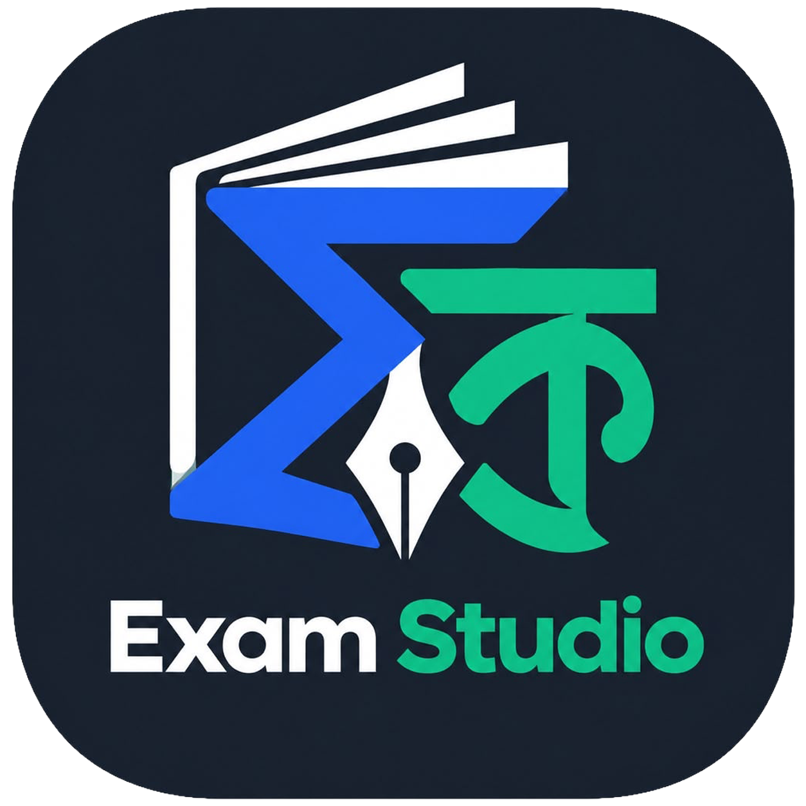

<div align="center">
  
  <h1>Exam Studio</h1>
  <p><strong>Automated Bengali XeLaTeX Examination Studio in Pure Client-Side WebAssembly</strong></p>

  [](https://nextjs.org/)
  [](https://react.dev/)
  [](https://www.typescriptlang.org/)
  [](https://tailwindcss.com/)
  [](https://webassembly.org/)
  [](https://eslint.org/)
</div>

---

## 📖 Overview

**Exam Studio** is a high-performance web application designed for educators, schools, and academic institutions to generate official Bangladeshi NCTB-standard examination papers.

Unlike traditional LaTeX systems requiring local TeX Live installations or remote compilation servers, **Exam Studio executes the entire XeLaTeX typesetting engine directly inside the browser using WebAssembly**. Everything—from Bengali font shaping and mathematical formula layout to multi-pass booklet imposition—runs 100% client-side with **zero server dependencies** and **offline capability**.

---

## ✨ Key Features

- **🚀 100% In-Browser XeLaTeX WebAssembly Engine**:
  - Compiles full Bengali LaTeX documents using WebAssembly TeX Live (`texlyre-busytex`).
  - True Bengali OpenType rendering with `Kalpurush.ttf` via `fontspec` and `polyglossia`.
  - Zero backend compilation latency, zero API costs, and total data privacy.

- **📑 Automated NCTB-Standard Multi-Section Exam Generation**:
  - **Creative Questions (CQ)**: Formatted in portrait A5 with 3-column borderless layout, sub-questions (ক, খ, গ, ঘ), marks distribution, and embedded tables.
  - **Short Questions (SQ)**: Numbered short-answer questions formatted for compact layouts.
  - **Multiple Choice Questions (MCQ)**: 2-column A4 layout with automatic option grid calculator (1x4, 2x2, or 4x1 stacking based on option text length).
  - **MCQ Solutions**: Comprehensive explanation and answer key tables.

- **📖 2x1 Folded Booklet Imposition**:
  - Automated in-memory page imposition using `pdf-lib`.
  - Reorders A5 CQ/SQ pages into printable 2x1 landscape A4 booklet signatures (`{pLast, pFirst, pSecond, pThird}`) for double-sided folding.
  - Merges booklets, MCQs, and solutions into a single master PDF.

- **📱 Optimized Mobile & Desktop PDF Canvas Viewer**:
  - Native HTML5 PDF canvas renderer with device-pixel-ratio (DPR) crispness.
  - Zero trailing scroll space, dynamic fit-to-width, rotation, page navigation, and live scroll tracking via `IntersectionObserver`.

- **⚡ Dual Web Worker Architecture**:
  - **Worker 1 (`asset-downloader.worker.ts`)**: Streams and unpacks the 78MB compiler bundle into IndexedDB with real-time download speed and byte progress.
  - **Worker 2 (`latex-compiler.worker.ts`)**: Loads cached WASM binaries and styles strictly from IndexedDB with 0 network calls during compilation.

- **💾 30-Day Instant Persistent Cache**:
  - Synchronous `< 0.2ms` cache check on startup.
  - Background asset verification and worker pre-warming.
  - Android-safe persistent storage lock via `navigator.storage.persist()`.

- **✍️ Monaco JSON Editor & Mobile Tools**:
  - Syntax highlighting, Zod schema validation, and real-time LaTeX source stream preview.
  - Bengali math symbol quick-input bar.
  - Mobile-friendly **Direct JSON File Upload** and **Clipboard API Paste** to prevent mobile keyboard buffer freezes on large exam sets.

---

## 🏗️ Architecture & Data Flow

```
[Exam JSON Input] ──► [Zod Schema Validation] ──► [TypeScript Modular LaTeX Generator]
                                                              │
                                       ┌──────────────────────┴──────────────────────┐
                                       ▼                                             ▼
                                [CQ + SQ (A5)]                                  [MCQ + Sol (A4)]
                                       │                                             │
                                       ▼                                             ▼
                            [WASM XeLaTeX Pass 1]                         [WASM XeLaTeX Pass 2 & 3]
                                       │                                             │
                                       ▼                                             │
                         [pdf-lib 2x1 Booklet Imposer]                               │
                                       │                                             │
                                       └──────────────────────┬──────────────────────┘
                                                              ▼
                                                 [Master Unified Exam PDF]
                                                              │
                                                              ▼
                                                [HTML5 DPR Canvas Viewer]
```

---

## 🛠️ Tech Stack

| Domain | Technology |
| :--- | :--- |
| **Framework** | [Next.js 16.3 (App Router)](https://nextjs.org/) + [React 19](https://react.dev/) |
| **Language** | [TypeScript 5.8](https://www.typescriptlang.org/) |
| **Styling** | [Tailwind CSS v4](https://tailwindcss.com/) + [shadcn/ui](https://ui.shadcn.com/) |
| **TeX Engine** | [texlyre-busytex](https://github.com/TeXlyre/texlyre-busytex) (WebAssembly XeLaTeX) |
| **PDF Processing** | [pdf-lib](https://pdf-lib.js.org/) + [pdfjs-dist](https://mozilla.github.io/pdf.js/) |
| **Editor** | [@monaco-editor/react](https://github.com/suren-atoyan/monaco-react) |
| **Validation** | [Zod](https://zod.dev/) |
| **Quality & Tests** | [ESLint 9 Flat Config](https://eslint.org/) + [Knip](https://knip.dev/) + [tsx](https://github.com/privatenumber/tsx) |

---

## 🚀 Getting Started

### Prerequisites

- [Node.js](https://nodejs.org/) `>= 20.0.0`
- [pnpm](https://pnpm.io/) `>= 9.0.0`

### Installation

1. **Clone the repository**:
   ```bash
   git clone https://github.com/your-username/exam-ques-gen.git
   cd exam-ques-gen
   ```

2. **Install dependencies**:
   ```bash
   pnpm install
   ```

3. **Fetch & build LaTeX compiler bundle** (if updating styles or binaries):
   ```bash
   pnpm fetch:styles
   ```

4. **Run the development server**:
   ```bash
   pnpm dev
   ```

5. **Open the application**:
   Navigate to [http://localhost:3000](http://localhost:3000) in your browser.

---

## 🧪 Testing & Code Quality

Exam Studio enforces zero-warning code quality standards:

```bash
# Run automated pipeline test suite (Bangla converter, imposition math, LaTeX generator, pdf-lib)
pnpm test

# Run strict ESLint 9 checks
pnpm lint

# Run dead code and unused dependency audit
pnpm dlx knip

# Build optimized production bundle
pnpm build
```

---

## 📁 Project Structure

```
├── app/                        # Next.js App Router entrypoints & layouts
│   ├── globals.css             # Tailwind CSS v4 design tokens
│   ├── layout.tsx              # Root HTML layout & theme provider
│   ├── not-found.tsx           # 404 handler
│   └── page.tsx                # Studio workspace & state management
├── components/                 # React UI components
│   ├── ui/                     # shadcn/ui accessible primitives
│   ├── ai-prompt-dialog.tsx    # LLM prompt generator assistant
│   ├── app-splash-screen.tsx   # 30-day preloader with background warm-up
│   ├── compiler-logs-drawer.tsx# Milestone compilation log inspector
│   ├── json-editor-panel.tsx   # Monaco JSON editor + mobile symbol bar
│   ├── latex-preview-panel.tsx # Real-time LaTeX source stream viewer
│   ├── mobile-settings-sheet.tsx# Mobile options & JSON import sheet
│   ├── mobile-symbol-bar.tsx   # Mobile math symbol accessory bar
│   ├── pdf-canvas-viewer.tsx   # Multi-page DPR canvas renderer
│   ├── pdf-viewer-panel.tsx    # PDF controls & download actions
│   └── theme-toggle.tsx        # Dark / Light theme switcher
├── lib/                        # Core application business logic
│   ├── compiler/               # In-browser WASM compilation pipeline
│   │   ├── asset-cache.ts      # IndexedDB font & bundle cache manager
│   │   ├── binary-cache.ts     # Zero-RAM binary asset cache
│   │   ├── bundle-registry.ts  # Compiler asset manifests & versions
│   │   ├── engine.ts           # LatexCompilerEngine singleton
│   │   ├── pdf-cache.ts        # 1-hour compiled PDF cache store
│   │   ├── pdf-imposer.ts      # pdf-lib 2x1 booklet imposition engine
│   │   ├── styles-cache.ts     # IndexedDB LaTeX styles cache
│   │   ├── styles-registry.ts  # LaTeX package registries (.sty / .ldf)
│   │   └── types.ts            # Compiler worker message types
│   ├── generator/              # LaTeX source generation
│   │   ├── imposition.ts       # Booklet page ordering algorithms
│   │   ├── index.ts            # Generator bundle entry point
│   │   ├── latex.ts            # Modular LaTeX templates generator
│   │   ├── presets.ts          # SSC NCTB subject presets & defaults
│   │   └── types.ts            # Zod schemas & TypeScript types
│   ├── templates/              # Base LaTeX preambles & master documents
│   └── sample-data.ts          # Default 5-section NCTB model test JSON
├── public/                     # Static assets
│   ├── compiler-bundle.zip     # Complete offline TeX Live WASM bundle
│   └── logo.png                # Studio logo
├── scripts/                    # Build & automation scripts
│   ├── fetch-styles.mjs        # CTAN package fetcher & compiler bundler
│   └── test-pipeline.ts        # Automated end-to-end pipeline test suite
└── workers/                    # Dedicated Web Workers
    ├── asset-downloader.worker.ts # Streamed bundle downloader & unpacker
    └── latex-compiler.worker.ts   # Multi-pass WebAssembly XeLaTeX compiler
```

---

## 📜 License

Distributed under the MIT License. See `LICENSE` for more information.
